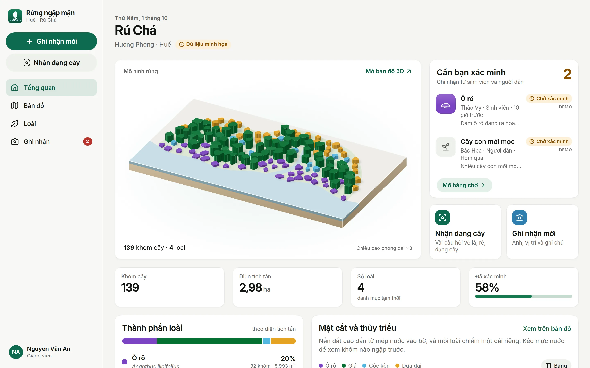

# Rừng ngập mặn Huế

Explore, identify and verify the **Rú Chá** mangrove forest (Hương Phong, Huế).
One responsive app for the web and for phones (installable, works offline),
designed for local residents, college students and advisors.



- **Design rationale, flows and design system:** [docs/redesign/README.md](docs/redesign/README.md)
- **Image prompts (species illustrations):** [docs/redesign/image-prompts.md](docs/redesign/image-prompts.md)
- **Feasibility and scope:** [docs/feasibility.md](docs/feasibility.md)
- Earlier static prototypes are kept in [prototypes/](prototypes/) for comparison.

## Run it

```bash
npm install
npm run dev          # http://localhost:3000
```

Requires Node 20+. The first visit shows onboarding; pick a role to see the
matching experience (switch later in **Hồ sơ → Vai trò**).

## Build and deploy

```bash
npm run generate     # static site in .output/public (SPA + service worker)
npx serve .output/public
```

Any static host works (Netlify, Vercel, GitHub Pages, Nginx on a VPS). Serve
`index.html` for unknown paths (`200.html` is generated for hosts that support
it). For a host without rewrites, build with hash routing:
`NUXT_HASH_ROUTER=1 npm run generate`.

## Data

| File | What | Replace with |
|---|---|---|
| `public/data/patches.geojson` | 139 **demo** patches (`npm run data:demo`) | QGIS export of digitised patches, same properties (`vegetation_patches`) |
| `public/data/context.geojson` | Hand-drawn **placeholder** base map | `npm run data:context` (OpenStreetMap; needs internet) |
| `app/data/species.ts`, `app/data/key.ts` | Species text and identification key (**drafts**) | Advisor-reviewed content |

Everything shown from demo or draft data is labelled in the app.

## Useful scripts

| Script | Does |
|---|---|
| `npm run typecheck` | Type-check the whole app |
| `npm run images` | Optimise generated images dropped into `app/assets/images/` |
| `npm run icons` | Re-render app icons from the mark |
| `npm run share-card` | Re-render the link-preview image (dev server running) |
| `npm run screens` | Re-capture the design gallery in `docs/redesign/screens/` (dev server running) |

## Stack

Nuxt 4 (client-rendered) · TypeScript · MapLibre GL JS 6 · Inter · Lucide.
No backend yet: observations are stored on the device; see the design doc for
the planned SQLite API.
