# Redesign: Rừng ngập mặn Huế

A complete redesign of the Rú Chá mangrove app, from onboarding to how the
data is shown, for **local residents, college students and advisors**, on the
**web and on phones** (one responsive codebase, installable as an app).

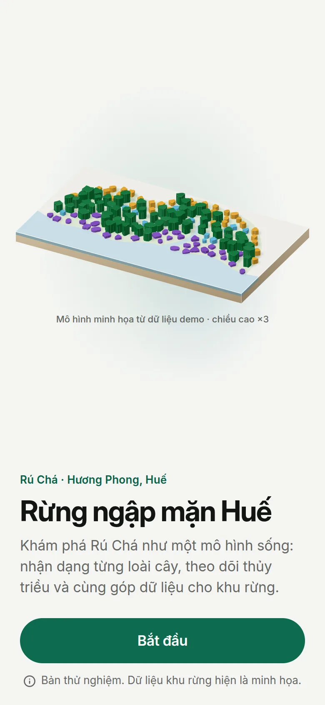 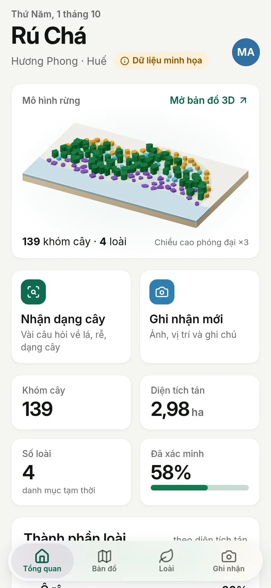 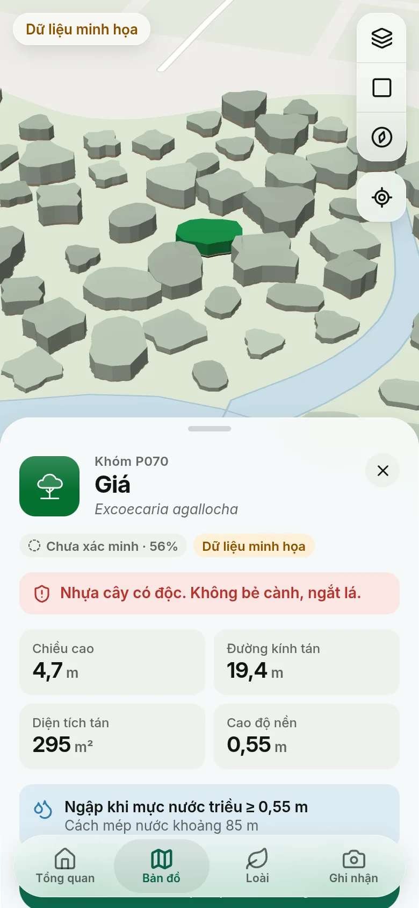 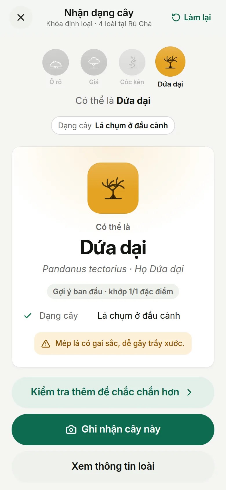


---

## 1. What changed

| Before (beta prototypes) | After |
|---|---|
| Two static HTML pages: a map and a dashboard card | A full app: onboarding, Home, Map, Species, Identify, Observations, review, Profile, About |
| One audience, controls everywhere | Three roles with their own priorities; controls appear where they are needed |
| Grid of grey blobs on a hand-drawn base | Organic demo forest with zonation, a tidal creek and ponds; refined cartography in light and dark |
| Map toolbar and footer full of buttons | Clean full-bleed map with four glass controls, a layers menu, a phone sheet and a desktop panel + inspector |
| KPI tiles and one stacked bar | A **cross-section with a draggable tide**, composition, verification meter, range bars and an honest "coming soon" extent chart |
| Desktop-first | Mobile-first: floating tab bar, sheets, large titles, 44 px targets, safe areas, offline |

## 2. Principles

1. **Everything earns its place.** No decorative imagery and no chart without a
   question it answers. Generated images are limited to species art (see
   [image-prompts.md](image-prompts.md)).
2. **The product is the hero.** The visual identity is the forest itself: an
   isometric diorama rendered from the live dataset (onboarding, Home, share
   card), the same patches you then touch on the map.
3. **Honest by default.** Demo data, drafts and simulations are labelled where
   they appear, and link to *Về dữ liệu*. Verification is shown by outline
   style + icon + words, never colour alone. Height exaggeration always shows a
   badge. Nothing is plotted that has not been measured.
4. **Field-ready.** Large targets, readable outdoors, works on cheap Android
   phones (the diorama is SVG, not WebGL), offline after the first visit,
   permissions asked in context, never up front.
5. **Plain Vietnamese.** Short sentences, no unexplained jargon (e.g. "Mặt cắt
   và thủy triều" with a one-line explanation).

## 3. Who it is for

| Role | Comes for | Home leads with |
|---|---|---|
| **Người dân địa phương** | Understanding the forest, reporting erosion/cutting/waste/new seedlings | Diorama → quick actions ("Báo hiện trạng") → tide cross-section |
| **Sinh viên** | Learning species, field records for courses, data for reports | Diorama → actions → key figures → composition; their own observations |
| **Giảng viên · Cố vấn** | Verifying observations, data quality | **Review queue** first, then figures, composition, cross-section |

The role is chosen in onboarding and can be switched in Profile (the beta allows
switching so every experience can be demonstrated).

## 4. Information architecture

```
Tab bar (phones) / sidebar (≥ 768 px)
├── Tổng quan (Home)        role-aware dashboard
├── Bản đồ (Explore)        2.5D map · ?patch= ?species= ?tide=1 deep links
├── Loài (Species)          library → species page → Nhận dạng (identify key)
└── Ghi nhận (Observations) Cộng đồng · Của tôi · Chờ xác minh (advisors)
                            → new observation · detail + review
Profile (avatar / sidebar)  appearance, role, install, export, reset → Về dữ liệu
```

Primary tasks are one tap away everywhere: *Ghi nhận mới* and *Nhận dạng cây*
(Home tiles, sidebar buttons, map patch actions, species pages, app shortcuts).

## 5. Key flows

**Onboarding (4 short steps):** Welcome (diorama colours itself in, one
sentence, one button) → what you can do (4 rows, Apple "Welcome" style) →
role (3 cards) → name (+ class code for students, organisation for advisors).
No account wall and no permission prompts.

**Explore → act:** tap a clay-grey patch → it takes its species colour and the
sheet/inspector shows species, verification, measurements, *when it floods*,
a toxic-sap warning where relevant, and actions: *Ghi nhận tại khóm này*,
*Về loài*, and for advisors *Đánh dấu đã xác minh*.

**Identify:** an adaptive multi-access key. Each step asks the question that
best splits the remaining candidates (most species are separated in 1–2
answers); answers stay as editable chips; any question can be answered out of
order; eliminated species visibly drop out. The result explains *why* (matched
characters), states confidence, offers "Kiểm tra thêm" to confirm, and links
to recording the plant. Contradictions lead to "closest matches + ask an
advisor", never a fake answer. Safety: the latex question warns not to break
twigs.

**Observe → verify → map:** one scrolling form (kind → photos → species or
condition → location via GPS / map picker / patch → note). Advisors review from
a queue (verify, correct the species, or request more info with a comment),
auto-advance to the next item, and can mark the nearby patch as verified,
which updates the map's outline. That closes the loop between community
observations and the forest model.

## 6. How data is shown

Method: the chart form is chosen by the question; colour is assigned by its job
(identity, status, water); categorical palettes are validated for colour-vision
deficiency; every chart has a text alternative and a table view; tooltips add
detail but never hold information that is not available elsewhere.

| Question | Form |
|---|---|
| What is the forest made of? | 100 % stacked bar + legend-table (canopy share, count, area) in water→inland order |
| How are species zoned and what floods? | **Cross-section** scatter: distance from water (x) × ground elevation (y); a water band rises with the tide slider so flooded patches read as submerged; "N/139 khóm đang ngập" |
| How reliable is the data? | Verification meter; solid vs dashed outlines on the map; confidence % per patch |
| How tall is this species here? | Range bar on a shared scale with a median tick |
| Is the forest growing or shrinking? | Empty-state chart frame until the Sentinel-2 / Earth Engine results exist |

**Species palette:** chosen by OKLCH search and validated with the dataviz
validator for *all pairs* (on a map any two species can touch):

| Species | Light | Dark | Mnemonic |
|---|---|---|---|
| Giá (Excoecaria) | `#067132` | `#0e7a50` | deep leaf green, the dominant tree |
| Ô rô (Acanthus) | `#7c44c3` | `#8054d6` | its purple flowers |
| Dứa dại (Pandanus) | `#e5a323` | `#be8820` | its orange fruit |
| Cóc kèn (Derris) | `#54b8e1` | `#48a1c6` | sky blue climber |

Worst all-pairs CVD ΔE: 22.3 (light) / 11.8 (dark), normal-vision ΔE ≥ 19.8.
Amber and sky are below 3:1 on white, so they always come with labels, the
legend or a table.

## 7. Design system

* **Type:** Inter Variable (optical sizes, Vietnamese subset, self-hosted).
  Apple-style scale (Large Title 34 → Caption 11); line heights slightly taller
  than iOS so stacked diacritics (ể, ỗ, ậ) never collide. Scientific names in
  italic.
* **Colour:** neutral warm greys, one accent (deep mangrove green `#0d6b4f`),
  water blue for tide, reserved status colours (ok / warn / info / danger,
  always with icon + label). All text pairs ≥ 4.5:1. Dark mode is designed, not
  inverted, and the map restyles live.
* **Materials:** glass (backdrop blur) only over the map and for floating
  chrome; solid fallback for `prefers-reduced-transparency` and old devices.
* **Shape & depth:** 4-pt spacing, radii 6–28, continuous corners where the
  browser supports `corner-shape`, soft layered shadows.
* **Motion:** spring easing for sheets, segmented thumbs and steps; the diorama
  "colour-in"; all reduced under `prefers-reduced-motion`.
* **Components** (`app/components/ui`): Button, IconButton, Segmented, List +
  ListRow, Sheet (bottom sheet / dialog with focus trap), Badge, Switch, Slider,
  Stat, Empty. Domain components in `forest/`, `viz/`, `species/`,
  `observations/`.
* **Icons:** Lucide at 2 px stroke, plus 21 hand-drawn morphology glyphs
  (`CharacterArt.vue`) shared by the key, trait lists and species avatars.

## 8. Web and mobile

One Nuxt codebase, client-rendered:

* **< 768 px:** floating glass tab bar, large titles that collapse into a glass
  bar, bottom sheets (map sheet with 3 detents), safe-area aware.
* **≥ 768 px:** sidebar (icon rail until 1200 px) with *Ghi nhận mới* and
  *Nhận dạng cây*; multi-column layouts; map with overview panel, inspector and
  hover popover.
* **Installable (PWA):** manifest with app shortcuts, maskable icons, and a
  service worker for offline use in the forest (app shell, data and satellite
  tiles cached). A native wrapper (Capacitor) can be added later without
  changing the UI.

## 9. Accessibility

Keyboard-reachable everything (segmented controls with arrow keys, sheets with
focus trap and Escape), visible focus rings, `aria-live` for the key's
candidate count and toasts, charts with text alternatives and table views,
colour never the only signal, touch targets ≥ 44 px, `prefers-reduced-motion`,
`prefers-reduced-transparency` and `forced-colors` respected.

## 10. Data and what is still demo

| Data | Today | To make it real |
|---|---|---|
| Patches (`public/data/patches.geojson`) | 139 generated patches (`npm run data:demo`), schema `vegetation_patches` | Digitise from flycam orthomosaic in QGIS, export GeoJSON with the same properties |
| Base map (`public/data/context.geojson`) | Hand-drawn placeholder | `npm run data:context` (OpenStreetMap, needs internet) |
| Species text & key | Draft | Advisor review + references + field photos |
| Extent over time | Not available | Earth Engine L1 classification, then a small JSON per year |
| Observations | Stored on the device (IndexedDB + localStorage) | API + SQLite (`/api/observations`), auth for advisors |

The UI reads data only through `useForest()` / `useObservations()`, so swapping
static files for API calls is local to those two composables.

## 11. Open decisions for the team

1. **Name.** The app uses the descriptive "Rừng ngập mặn Huế" (short name
   "Ngập mặn"). A shorter brand can be swapped in one place if wanted.
2. **Real photos.** Lecturer photos should replace generated species art once
   available.
3. **Accounts.** Advisor verification needs real sign-in before launch.
4. **Languages.** Vietnamese only for now; English could be added for
   visiting researchers.

## Screens

| | |
|---|---|
| 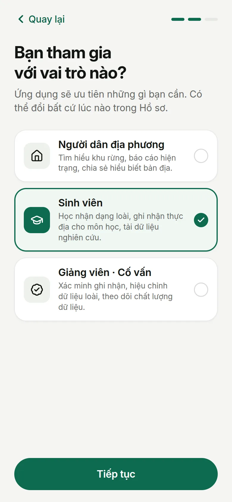 | 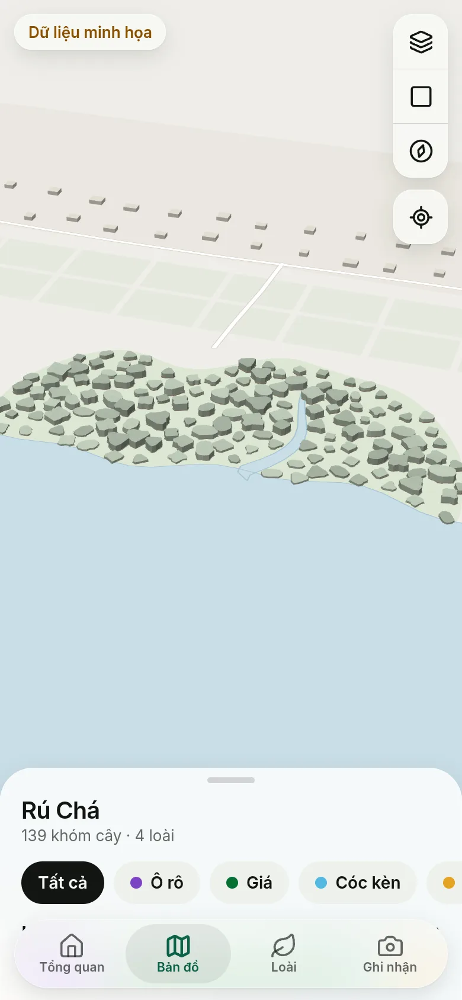 |
| 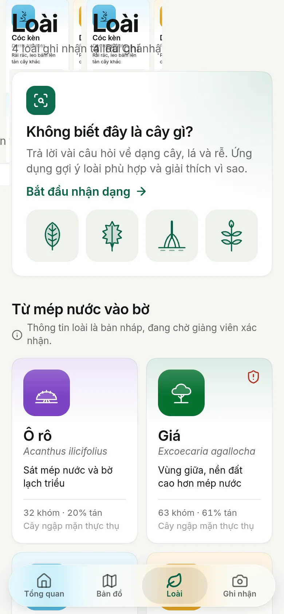 | 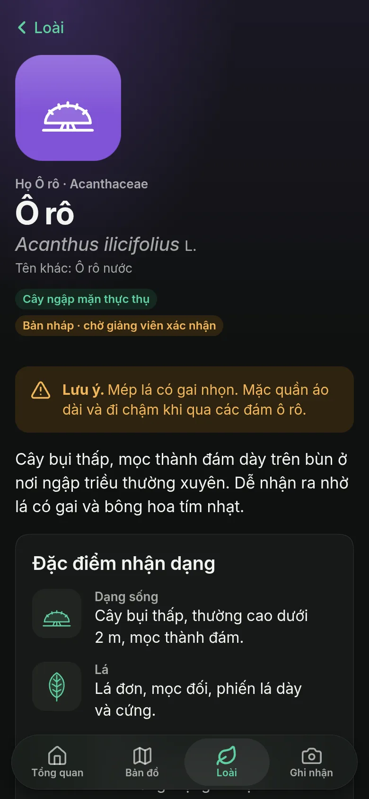 |
| 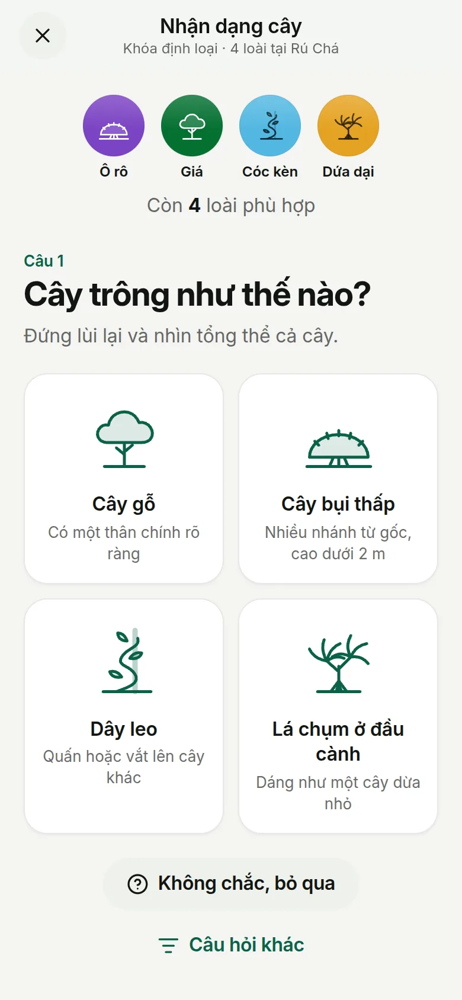 | 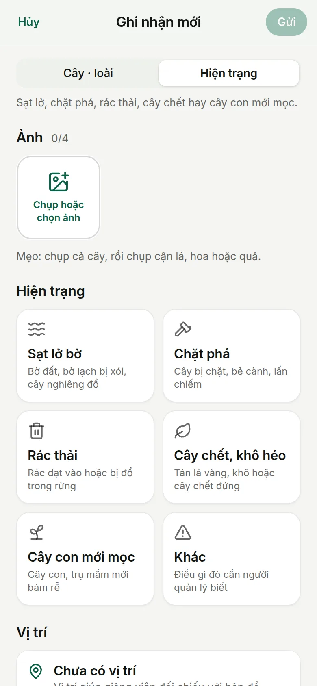 |
| 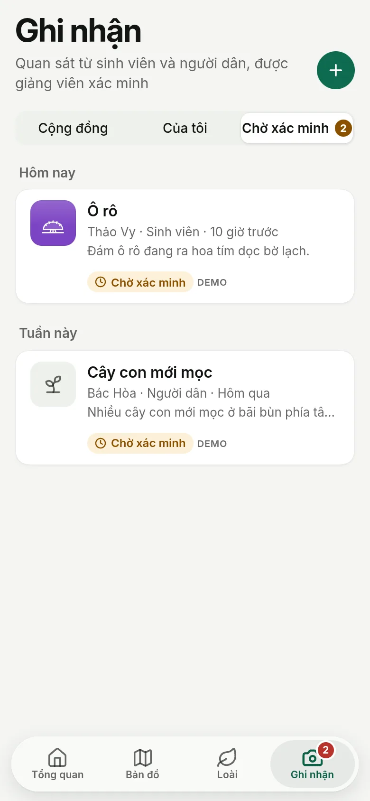 |  |

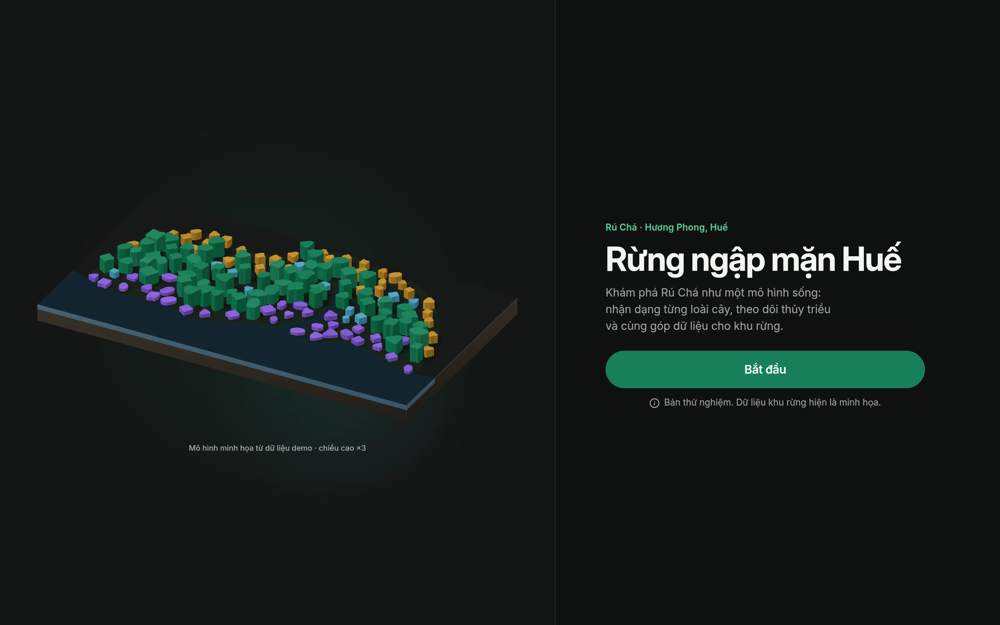
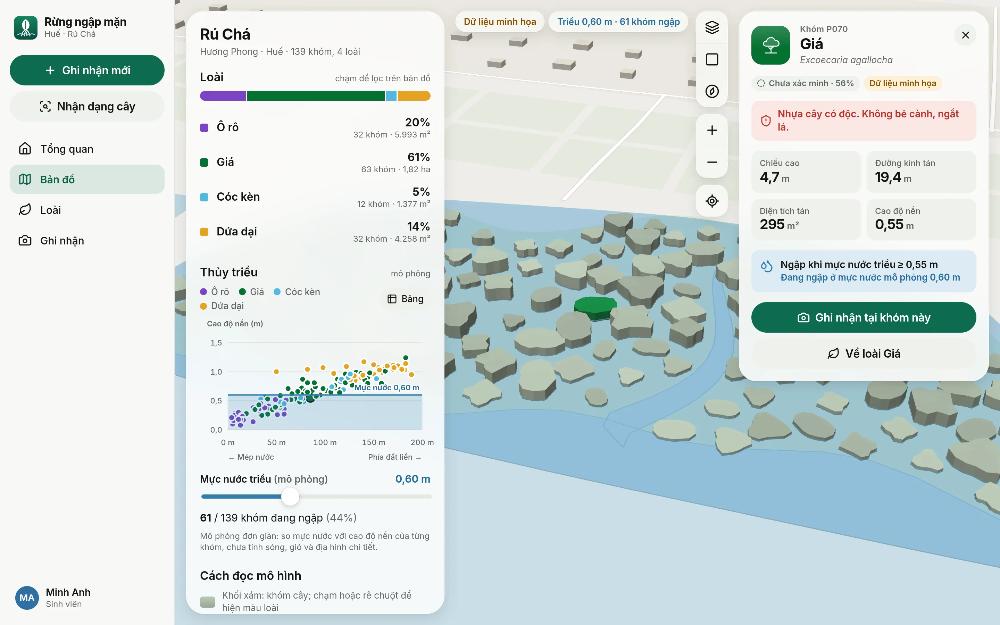
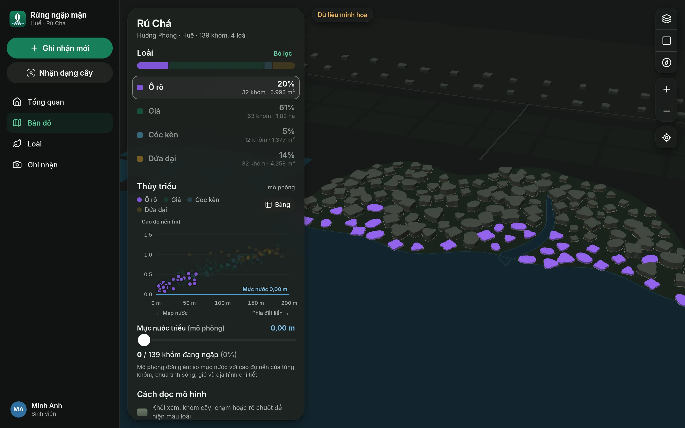
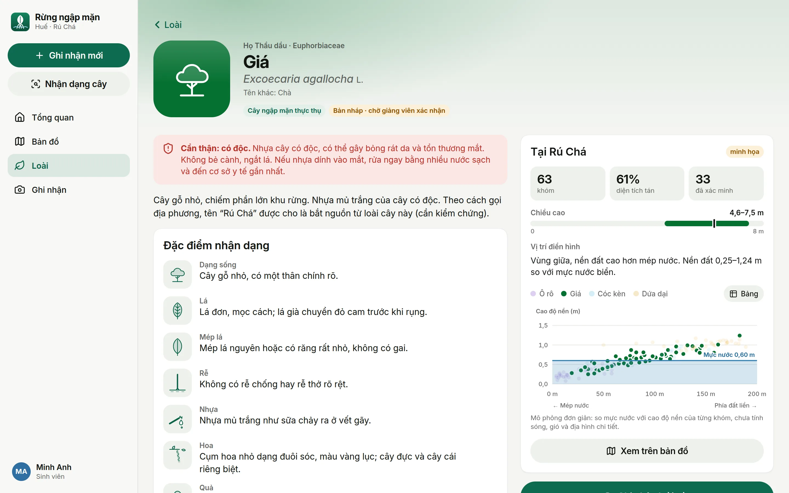
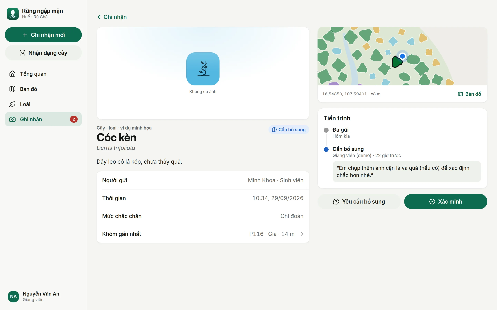
